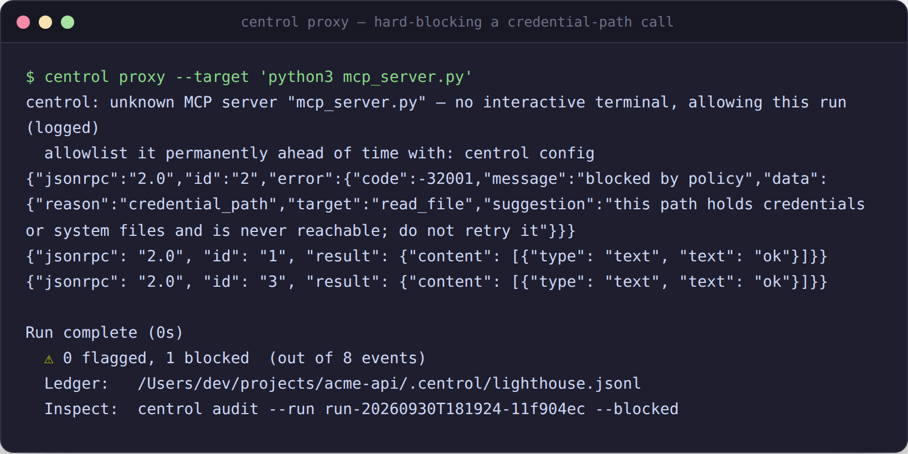
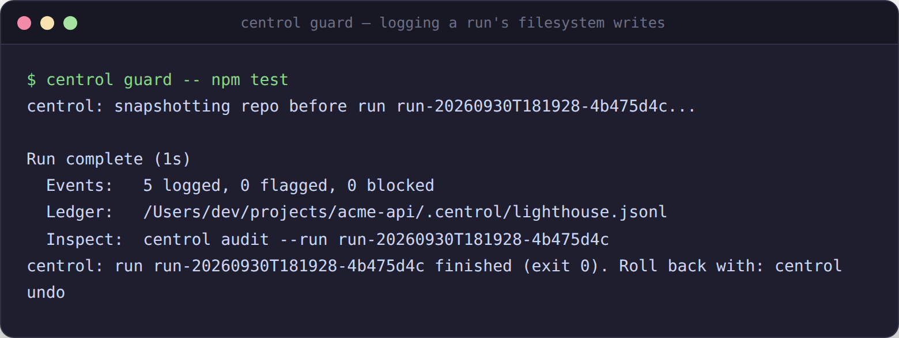
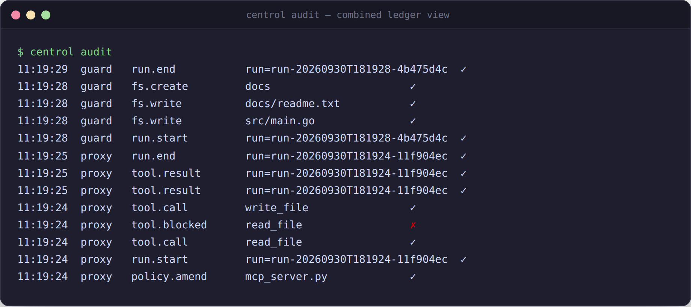

# centrol

A local-first accountability layer for coding agents (Claude Code, Cursor,
Windsurf, or anything else you run from a terminal or point at an MCP
server). Free, offline, no telemetry, no account required.

centrol doesn't control everything your agent can do — only what passes
through the two interfaces it wraps, the filesystem and MCP tool calls.
Within those, it blocks what violates policy and gives you an
append-only, hash-chained record of everything else, so you can review
it, verify it hasn't been tampered with, and roll it back.

## See it in action

`centrol proxy` hard-blocking a tool call that reaches for a credential
path, before it ever touches the target MCP server:



`centrol guard` wrapping a run — snapshot first, then every filesystem
write logged as it happens:



`centrol audit` — the combined ledger, allowed and blocked events side
by side:



## Install

Single static binary, no dependencies. Downloads the release asset for
your platform and installs it to `/usr/local/bin` (override with
`CENTROL_INSTALL_DIR`).

```sh
curl -fsSL https://raw.githubusercontent.com/baitelmal/centrol/main/install-centrol.sh | sh
```

## Quickstart

```sh
# Wrap an interactive agent session; nothing to configure first.
centrol guard -- claude

# Or front an MCP server so its tool calls get logged and policy-checked.
centrol proxy --target "npx @modelcontextprotocol/server-filesystem /path/to/allow"

# See what happened.
centrol audit

# Confirm the record hasn't been tampered with.
centrol audit --verify

# Undo the most recent run's changes.
centrol undo
```

No flags are required for the common case. `centrol guard -- <command>`
snapshots your repo, watches it while `<command>` runs, and lets you roll
back with `centrol undo` afterward.

## Coverage matrix

| Action             | guard | proxy | notes                |
|--------------------|:-----:|:-----:|-----------------------|
| File write          | flag  |   -   | logged; never blocked |
| MCP tool call        |   -   | yes   | validated, logged, hard-blocked when denied |
| Direct shell         | log   |   -   | not intercepted       |
| Network (non-MCP)    | log   |   -   | not intercepted       |

This is an accountability layer, not a sandbox. It records and reverses
governed actions. It does not prevent a determined agent from acting
outside the governed interfaces.

**guard and proxy enforce differently — this is deliberate, not a gap:**
`centrol guard` never blocks a filesystem write, not even one to a
credential path (`~/.ssh`, `~/.aws`, `/etc`, ...) — it logs every
out-of-scope or protected-path write as `policy.violation` and lets it
through, because a filesystem watcher observes writes after they've
already landed on disk; there's nothing left to block. `centrol proxy`
is different: it sits in front of the call *before* it reaches the MCP
server, so a tool call that resolves to a protected path is genuinely
never forwarded — the caller gets a structured denial instead (see
"Policy denials" below). If you need a hard guarantee that a credential
path is never touched, that guarantee exists on the proxy path, not the
guard path.

## Honest scope of `centrol undo`

- Restores tracked git state (via the snapshot taken before the run) plus
  untracked files present at snapshot time.
- Does **not** restore ignored files, databases, or other external state.
- Does **not** restore running processes or open file handles.
- Detects and reports changes it cannot restore (files created after the
  snapshot that the snapshot never captured) rather than silently
  dropping them.
- Every rollback takes its own pre-undo snapshot first, so a rollback
  that fails partway is itself recoverable with
  `centrol undo --from <run_id>.pre-undo`.

## Commands

```
centrol guard -- <agent command>       wrap an agent run
centrol guard --scope <path> -- ...    same, narrowed to one or more paths
centrol guard --observe -- ...         evaluate policy without ever prompting or blocking
centrol guard --quiet -- ...           log_level=warn for this run
centrol guard --verbose -- ...         log_level=debug for this run (traces every governed event)
centrol proxy --target <mcp server>    run the MCP gateway
centrol proxy --observe --target ...   same evaluate-only mode, for the MCP path
centrol proxy install <client>         patch a client's MCP config
centrol audit                          view the ledger
centrol audit --flagged                only policy.violation entries
centrol audit --blocked                only tool.blocked entries
centrol audit --since 30m|1h|2d        entries from the last window
centrol audit --run <run_id>           entries from one run only
centrol audit --verify                 verify hash-chain integrity across all segments
centrol undo                           restore the last snapshot
centrol undo --list                    list snapshots
centrol undo --from <snapshot_id>      restore a specific snapshot
centrol scope +<path>                  widen the current run's contract
centrol status                         active run, contract, honesty score
centrol config                         interactive menu: allowlist, gate, proxy, guard, general, thresholds
centrol verify                         [reserved for v0.3] validate a change before it lands
```

`--quiet`/`--verbose` never suppress errors or the run summary printed at
the end of every `guard`/`proxy` invocation (see "Run summary" below) —
they only raise or lower the bar for the info-level step/state lines in
between.

## `centrol proxy install`

```
centrol proxy install claude-desktop     patch Claude Desktop's MCP config
centrol proxy install cursor             patch Cursor's MCP config
centrol proxy install windsurf           patch Windsurf's MCP config
```

Rewrites every locally-run (stdio) MCP server entry in that client's
config file so it launches through `centrol proxy --target ...` instead
of directly — the client itself doesn't change, and every tool call it
makes to that server is now logged and policy-checked. Remote servers
(anything configured with a `url`/`serverUrl` instead of a `command`)
are left untouched, since this proxy only fronts stdio targets. Always
backs up the original config first (`<config>.centrol-backup-<timestamp>`)
and is safe to re-run — an already-wrapped entry is left alone. The
client needs to have been opened at least once already, so its config
file exists; restart the client afterward for the change to take
effect.

## Config (`.centrol/config.toml` or `~/.centrol/config.toml`)

Repo config (`.centrol/config.toml`) takes priority over user config
(`~/.centrol/config.toml`), which takes priority over centrol's own
built-in defaults. `centrol config` edits either file interactively and
shows, for every key, which one currently wins. Any key can also be
edited by hand — the menu and the file always agree, because both go
through the same resolver.

```toml
[guard]
mass_mutation_threshold = 20        # files touched by one action before it's flagged as mass mutation
watcher_debounce_ms = 300           # coalesce rapid writes to the same path into one ledger entry

[gate]
prompt_timeout_seconds = 120        # a flagged action with no answer in time is denied, not left hanging
allow_session_amend = true          # "Allow session" persists for the rest of this run only

[proxy]
allowed_servers = []                # MCP server identities pre-approved without a prompt
strict_matching = false             # true: match server identity exactly, not just by package/binary
additional_block_paths = []         # extra hard-blocked paths for the proxy, on top of the built-in ~/.ssh, ~/.aws, /etc, /root
                                     # (proxy-only — see the guard/proxy enforcement note above; guard flags a
                                     # write to any of these paths but does not, and cannot, block it)
mcp_call_timeout_seconds = 30       # a forwarded MCP call with no response in time is dropped, not left hanging

[general]
log_level = "info"                  # "info" | "warn" | "debug" — overridden per run by --quiet/--verbose
observe_mode = false                 # true: evaluate policy everywhere, never prompt, never block
```

Every key above is live — it changes real behavior, not just what gets
logged. `centrol config`'s "View effective config" section shows the
resolved value and source (`session_contract` / `enterprise_policy` /
`repo_config` / `user_config` / `default`) for each one.

## Run summary

Every `centrol guard` and `centrol proxy` invocation prints a summary on
its way out — on a normal exit, on a panic, and on Ctrl-C (SIGINT, exit
130) or SIGTERM (exit 143). `--quiet` never suppresses it.

```
Run complete (14s)
  Events:   6 logged, 0 flagged, 0 blocked
  Ledger:   .centrol/lighthouse.jsonl
  Inspect:  centrol audit --run run-20260929T120000-abcd1234
```

If anything was flagged or blocked, the count is called out and the
suggested next command changes accordingly:

```
Run complete (14s)
  ! 2 flagged, 1 blocked  (out of 9 events)
  Ledger:   .centrol/lighthouse.jsonl
  Inspect:  centrol audit --run run-20260929T120000-abcd1234 --blocked
```

(`!` is the ASCII fallback for `⚠`; see "Terminal output" below.)

## Observe mode

`--observe` (or `general.observe_mode = true`) runs the exact same policy
evaluation as a normal run, but never prompts and never blocks — every
decision that would have flagged or blocked is logged instead as
`would_flag` / `would_block`, and the write or tool call goes through
regardless. Use it to see what a stricter policy *would* have done
before turning it on for real. `centrol audit` renders these with a
distinct `◇` (ASCII fallback `o`) so an observe run's ledger is never
mistaken for an enforced one.

## Policy denials

A denial is never silent. Every hard block, operator "Deny", prompt
timeout, and MCP-call timeout comes back to the caller (in `centrol
proxy`) as a structured JSON-RPC error the agent can actually parse and
act on:

```json
{"jsonrpc":"2.0","id":7,"error":{"code":-32001,"message":"blocked by policy",
 "data":{"reason":"credential_path","target":"~/.ssh/id_rsa","suggestion":"..."}}}
```

("Protocol Silence" — a dropped frame with no response — is reserved for
malformed input, never for a legitimate denial. A denial is always a
JSON-RPC error, and the connection stays usable for the next call.)

## Terminal output

Color is used automatically on a real terminal and dropped when output
is piped/redirected or `NO_COLOR` is set. Glyphs (`⚠ ◇ ✓ ✗`) render as
Unicode only on a real UTF-8 terminal; everywhere else (piped output, a
non-UTF-8 locale) they fall back to ASCII (`! o + x`). Both are detected
once at startup per output stream, not re-checked per line.

## Walkthrough

A complete session, run verbatim against a real repo. The agent here is
a shell script standing in for a real coding agent: it edits a file
inside the declared scope, then creates a new file and directory outside
it.

```sh
$ git init -q && git add . && git commit -qm "initial commit"

$ centrol guard --scope src -- sh -c '
    echo "package main // added" >> src/main.go
    mkdir -p docs
    echo "notes" > docs/readme.txt
  '
centrol: snapshotting repo before run run-20260929T...

Run complete (0s)
  ! 2 flagged, 0 blocked  (out of 7 events)
  Ledger:   .centrol/lighthouse.jsonl
  Inspect:  centrol audit --run run-... --flagged
centrol: run run-... finished (exit 0). Roll back with: centrol undo
```

The scope was `src`, so the write inside it (`src/main.go`) is logged
plainly; the two writes outside it (`docs/` and `docs/readme.txt`) are
each also logged as `policy.violation`. `centrol guard` flags an
out-of-scope write like this one exactly the same way it would flag a
write to a credential path — neither is ever blocked; see "guard and
proxy enforce differently" above for why. The run summary calls this
out immediately and points straight at `--flagged`:

```sh
$ centrol audit --flagged
17:29:31  guard   policy.violation  docs/readme.txt           !
17:29:31  guard   policy.violation  docs                      !

$ centrol audit --verify
OK: 7 entries across 1 segment(s), chain intact
```

Rolling back restores everything the pre-run snapshot actually captured
— and says so plainly when it can't restore something the snapshot
never saw in the first place (a file created mid-run, after the
snapshot was taken):

```sh
$ centrol undo
centrol: pre-undo snapshot saved to .centrol/snapshots/run-....pre-undo
Restored from snapshot run-....
  tracked git state: restored
  untracked files restored: 0
  could NOT restore (created after the snapshot, not captured by it):
    - docs/readme.txt
```

`src/main.go` is back to its committed state; `docs/` and its contents
are left in place, exactly as reported — nothing is silently dropped,
and every step of this session is in the ledger `centrol audit --verify`
just confirmed is untampered.

## Roadmap

- **v0.1** — guard + proxy (current)
- **v0.2** — hardened surfaces, more tests, install polish
- **v0.3** — verify, a validator surface: attempt → test → invariant
  check → packet → approve/reject, gated the same way guard and proxy
  are today.

No dates are committed. This is the order the surfaces are meant to
arrive in, not a schedule.

### Auto-approve tiers

Every flagged action goes through a human decision today. As verify
matures, narrower auto-approval is planned — not shipped:

- **Tier 1 (default, ships in v0.1)** — every flagged action goes to
  human review. [Allow once | Allow session | Deny].
- **Tier 2 (planned)** — narrow auto-approve for small, clean changes
  that meet a strict bar (e.g. a single in-scope file, all tests pass,
  no protected paths touched).
- **Tier 3 (planned)** — broader auto-approve, gated behind an explicit
  credential and an expiring grant, for teams that have built enough
  trust in the invariant checks to widen the default.

Only Tier 1 exists today. Tiers 2 and 3 are direction, not a promise.

## Non-negotiables

- No telemetry. No phone-home. No account required. Works fully offline.
- The ledger is append-only and hash-chained across segments; the
  Governor is its only writer.
- Every blocked, flagged, or non-conforming action produces a ledger
  entry — non-conforming signals get silence outward, full capture
  inward.
- The session contract is ephemeral per run and purged at run end.
- `.centrol/` and `.git/` are excluded from the file watcher before any
  user config is consulted, unconditionally.
- Symlinks are resolved to their real location before policy evaluation;
  one pointing outside the repo root is never followed.
- A failed rollback never leaves the tree worse than the agent left it.
- `centrol proxy`'s client-facing stdout carries nothing but JSON-RPC
  frames — every prompt and error goes to stderr or the controlling tty.
